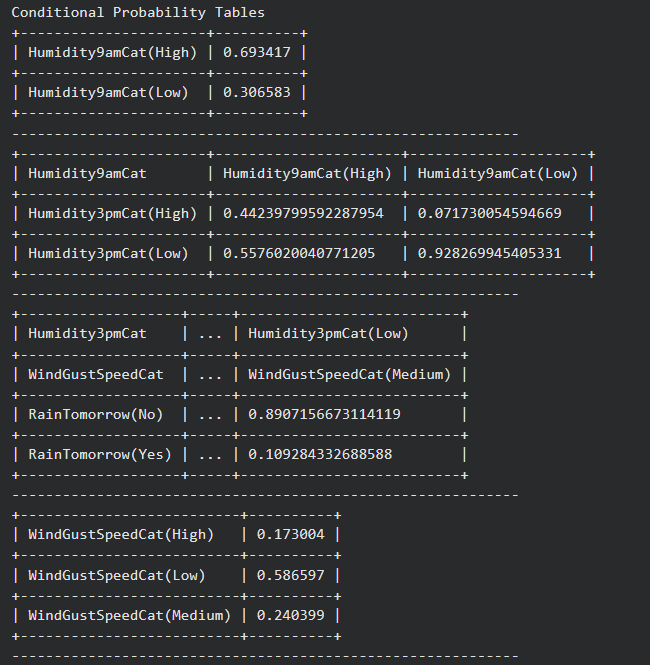
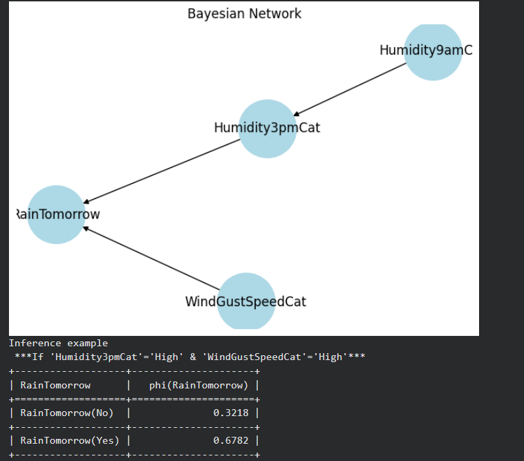

<H3> Name : SANTHOSE AROCKIARAJ J</H3>
<H3>Register No. : 212224230248</H3>
<H3> Experiment 1</H3>
<H3>DATE : 10/02/2026 </H3>
<H1 ALIGN=CENTER> Implementation of Bayesian Networks</H1>

## Aim :

    To create a bayesian Network for the given dataset in Python

## Algorithm:
Step 1 : Import necessary libraries: pandas, networkx, matplotlib.pyplot, Bbn, Edge, EdgeType, BbnNode, Variable, EvidenceBuilder, InferenceController<br/>

Step 2 : Set pandas options to display more columns<br/>

Step 3 : Read in weather data from a CSV file using pandas<br/>

Step 4 : Remove records where the target variable RainTomorrow has missing values<br/>

Step 5 : Fill in missing values in other columns with the column mean<br/>

Step 6 : Create bands for variables that will be used in the model (Humidity9amCat, Humidity3pmCat, and WindGustSpeedCat)<br/>

Step 7 : Define a function to calculate probability distributions, which go into the Bayesian Belief Network (BBN)<br/>

Step 8 : Create BbnNode objects for Humidity9amCat, Humidity3pmCat, WindGustSpeedCat, and RainTomorrow, using the probs() function to calculate their probabilities<br/>

Step 9 : Create a Bbn object and add the BbnNode objects to it, along with edges between the nodes<br/>

Step 10 : Convert the BBN to a join tree using the InferenceController<br/>

Step 11 : Set node positions for the graph<br/>

Step 12 : Set options for the graph appearance<br/>

Step 13 : Generate the graph using networkx<br/>

Step 14 : Update margins and display the graph using matplotlib.pyplot<br/>


## Program:
```python
#----------------------------------
# Imports
from pgmpy.models import DiscreteBayesianNetwork
from pgmpy.estimators import MaximumLikelihoodEstimator
from pgmpy.inference import VariableElimination

import pandas as pd
import matplotlib.pyplot as plt
import networkx as nx

#----------------------------------
# Load dataset
df = pd.read_csv("/content/weatherAUSnew.csv")

# Drop missing target
df = df[df['RainTomorrow'].notna()]

# Fill numeric missing values with mean
numeric_cols = df.select_dtypes(include=['number']).columns
df[numeric_cols] = df[numeric_cols].fillna(df[numeric_cols].mean())

#----------------------------------
# Discretize variables
df['WindGustSpeedCat'] = df['WindGustSpeed'].apply(
    lambda x: 'Low' if x <= 40 else 'Medium' if x <= 50 else 'High'
)

df['Humidity9amCat'] = df['Humidity9am'].apply(
    lambda x: 'Low' if x <= 60 else 'High'
)

df['Humidity3pmCat'] = df['Humidity3pm'].apply(
    lambda x: 'Low' if x <= 60 else 'High'
)

# Final DataFrame
bn_df = df[['WindGustSpeedCat','Humidity9amCat','Humidity3pmCat','RainTomorrow']]
for col in bn_df.columns:
    bn_df[col] = bn_df[col].astype(str)

#----------------------------------
# Define Bayesian Network structure
model = DiscreteBayesianNetwork([
    ('Humidity9amCat','Humidity3pmCat'),
    ('Humidity3pmCat','RainTomorrow'),
    ('WindGustSpeedCat','RainTomorrow')
])

#----------------------------------
# Train model
model.fit(bn_df, estimator=MaximumLikelihoodEstimator)

#Conditional probability
print("Conditional Probability Tables")
for cpd in model.get_cpds():
    print(cpd)
    print("-" * 60)

#----------------------------------
# Plot simple BN diagram
G = nx.DiGraph(model.edges())

plt.figure(figsize=(6,4))
nx.draw(G, with_labels=True, node_size=3000, node_color='lightblue')
plt.title("Bayesian Network")
plt.show()

#----------------------------------
# Inference example
inference = VariableElimination(model)
print("Inference example\n ***If 'Humidity3pmCat'='High' & 'WindGustSpeedCat'='High'***")
result = inference.query(
    variables=['RainTomorrow'],
    evidence={'Humidity3pmCat':'High','WindGustSpeedCat':'High'}
)

print(result)


```
## Output:





## Result:
   Thus a Bayesian Network is generated using Python

